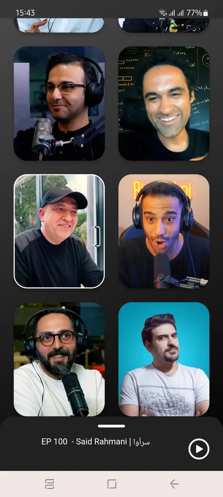
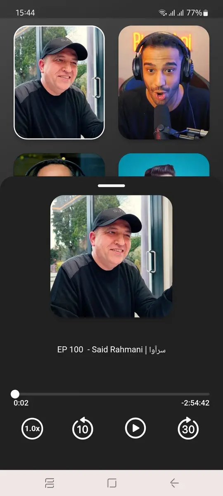
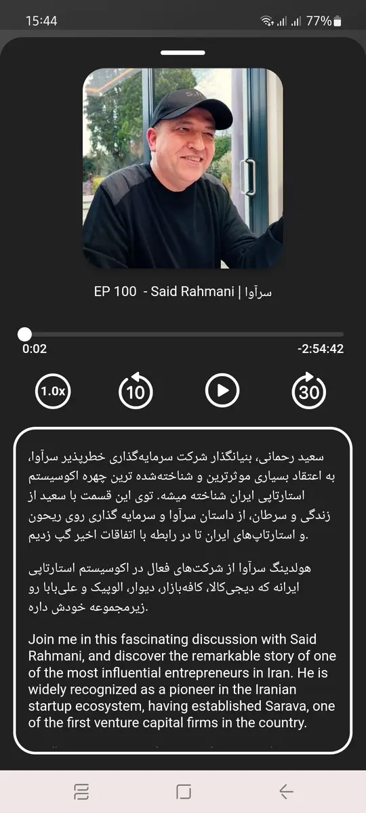

# Tabaghe 16 Podcast

If you are a professional podcast listener who works in the field of technology, or you are an activist in the startup ecosystem, you must know Sohail Alavi and the Tabaghe16  podcast.
 
I am one of the listeners of the Tabaghe16 podcast, from which I learned a lot. Apart from the technical and specialized discussion, the fact that the guests talk about their lifestyles and daily routines has its own charm.
 
If you're a programmer, chances are you listen to a podcast while coding. At least I am like this. One of those podcasts that I listen to while coding is Tabaghe16. Thanks to Sohail Alavi.

I already said on my [about page](https://rezababakhani.ir/about) that Flutter is very attractive and lovely to me. I always like to define a Flutter side project next to the commercial back-end projects I have.
 
This time I said that I would achieve two aims at once. Instead of listening to the podcast while coding, I code the podcast. ㋡
 
This is how I developed the Tabaghe16 app and listened to 2-3 episodes during development.
 
Perhaps a dedicated application for listening to podcasts is not very interesting and everyone prefers to use a podcast platform. It doesn't matter at all :D
[Download](https://github.com/Reza-Babakhani/tabaghe16-podcat/releases/download/v1/tabaghe16.apk)

